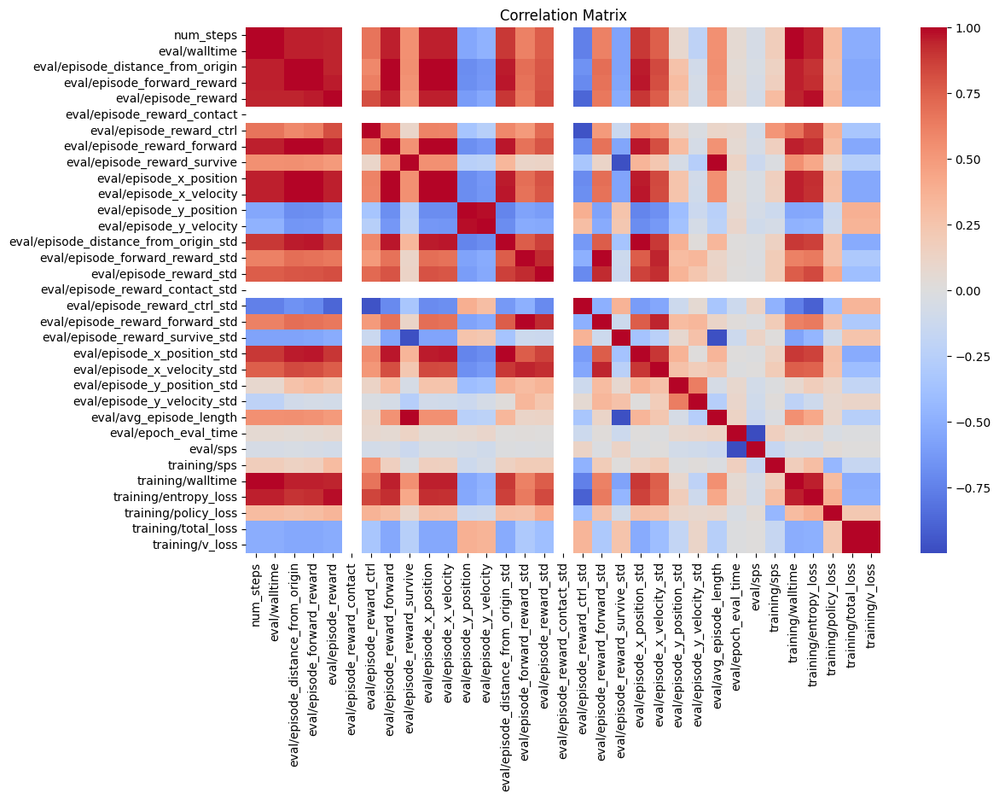
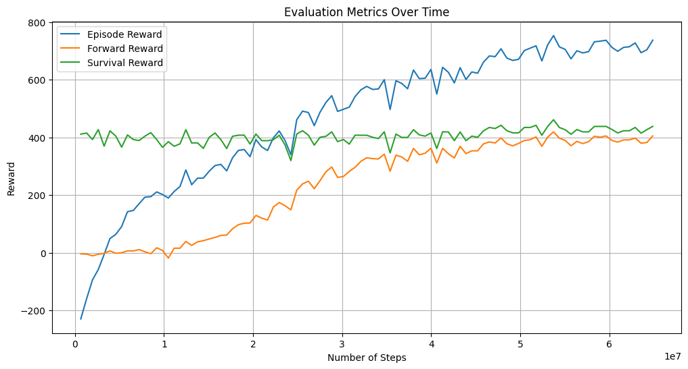
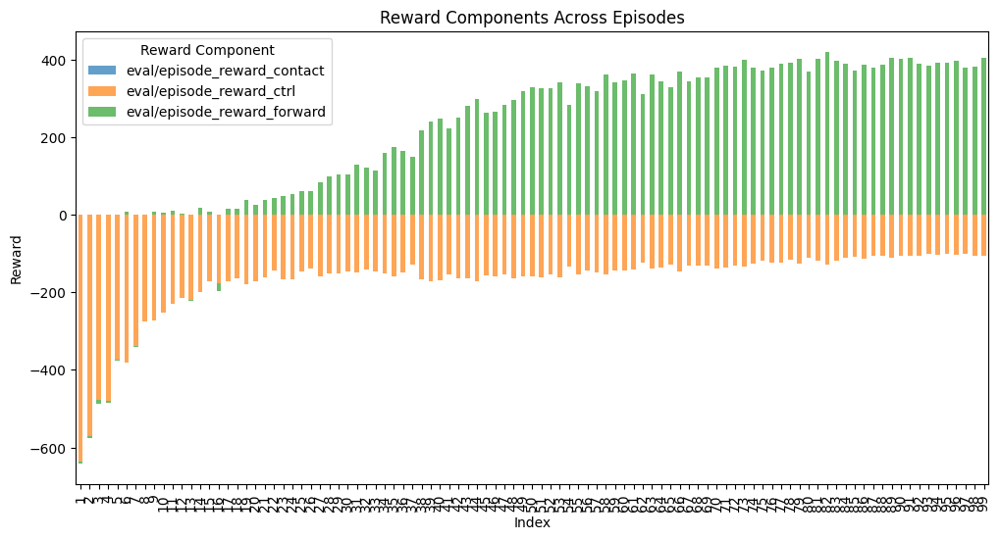
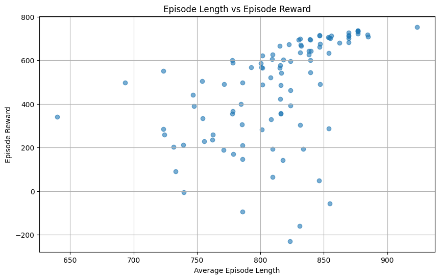

# Robotics & Sim2Real Locomotion

    
    
    

**Objective**: Enable robust sim2real transfer of learned locomotion policies for a custom-built hexapod robot.

**Approach**:
- **Simulation Environment**: Utilized **Google Brax**, a differentiable physics engine optimized for hardware acceleration, to train policies at scale.
- **Robot Modeling**: Defined the robot’s form using **MJCF**, capturing physical constraints and dynamics accurately.
- **Locomotion Training**: Conducted 100 million simulation steps, teaching the robot walking, running, and other advanced gaits through RL, again using **PPO**.
- **Sim2Real Transfer**: Successfully deployed the trained policies on a physical hexapod (controlled by a Raspberry Pi 4 Model B) with minimal adjustment, demonstrating high-fidelity transfer from simulation to the real world.

**Key Results**:
- Achieved stable and efficient locomotion in both simulation and hardware tests.
- Validated the effectiveness of differentiable physics-based simulation (Brax) in accelerating and improving RL training for complex robotics tasks.

---

# Robot Data Analysis
**Author**: [Abhilash Rana](https://www.linkedin.com/in/abhilash-rana-fl/)

**High Positive Correlations:**
- **eval/episode_reward with other reward related metrics:** There are strong positive correlations between **eval/episode_reward** and various reward types (**eval/episode_reward_forward**, **eval/episode_reward_contact**, etc.). This indicates that the overall reward is highly influenced by these individual components.
- **Training metrics:** **training/sps** (steps per second) is positively correlated with **training/walltime**, suggesting that faster training times (steps per second) are associated with longer overall training durations.

**Negative Correlations:**
- **eval/episode_distance_from_origin with rewards:** There are some negative correlations between the distance from the origin and various reward metrics. This suggests that as the agent moves further from its origin, the rewards may decrease or become less optimal.
- **Reward-related metrics vs. training losses:** Some training losses (e.g., **training/entropy_loss**, **training/total_loss**) show negative correlations with evaluation rewards, which could imply that poorer training performance correlates with lower rewards.

**Anomalies or Outliers:**
- **Correlation near 0 or negative correlations:** Look for areas where there is little to no correlation or an inverse relationship, as these might represent areas where the expected outcomes don't hold. For example, **eval/episode_reward_forward** shows little to no correlation with **training/v_loss**, which could be worth investigating further.

**Insights:**
- The overall **Episode Reward** (blue line) shows a steady increase, which suggests that the agent is becoming better at performing the tasks required by the environment.
- The **Forward Reward** (orange line) and **Survival Reward** (green line) show distinct growth patterns. The survival reward tends to increase more gradually, while the forward reward initially rises more sharply but is still lower than the episode reward.

**Breakdown of the Plot:**

1. **Reward Components**:
   - **eval/episode_reward_contact (blue):** Likely represents a reward or penalty related to contacts during the episode. Positive values mean favorable contact scenarios, while negative values indicate penalties (e.g., collisions or undesired interactions).
   - **eval/episode_reward_ctrl (orange):** Could represent a control cost or energy usage penalty. This is typically negative as it discourages excessive or inefficient control actions.
   - **eval/episode_reward_forward (green):** Likely the main objective, such as moving forward or achieving a goal. Positive values signify progress or performance improvements.

2. **General Trends**:
   - Over episodes, **eval/episode_reward_forward (green)** seems to dominate, showing steady improvement, indicating the agent is learning to achieve the goal better.
   - **eval/episode_reward_ctrl (orange)** remains consistently negative, suggesting a steady control penalty, but its magnitude seems relatively stable.
   - **eval/episode_reward_contact (blue)** fluctuates significantly, possibly due to randomness or difficulty in managing interactions. However, it becomes less negative over time, indicating improvement.

3. **Learning Progress**:
   - Early episodes show large penalties in contact and control, with minimal forward rewards.
   - As episodes progress, penalties decrease, and forward rewards increase, suggesting the agent is improving its policy over time.

4. **Episode Variability**:
   - There is considerable variation between episodes, especially in the early ones. This suggests the agent is still exploring or learning unstable policies.

**Scatter Plot Analysis:**

- **Positive Correlation:**  
  As the **Average Episode Length** increases, the **Episode Reward** tends to increase. This implies that longer episodes are generally more rewarding. This relationship suggests the agent performs better when it can sustain longer episodes, likely learning to optimize its actions.

- **Spread at Shorter Lengths:**  
  For shorter episode lengths (650–750), there is a significant spread in the rewards, with some episodes yielding negative rewards. This could indicate that the agent is still exploring suboptimal policies or failing early in these cases.

- **Concentration at Higher Lengths:**  
  For longer episodes (800–900), rewards are consistently high (mostly above 400), showing that the agent has likely developed a stable and effective policy for achieving its goals.

- **Learning or Optimization Trend:**  
  Over time, as the agent learns to optimize its actions, episodes become longer and more rewarding. This reflects an improvement in policy.

---