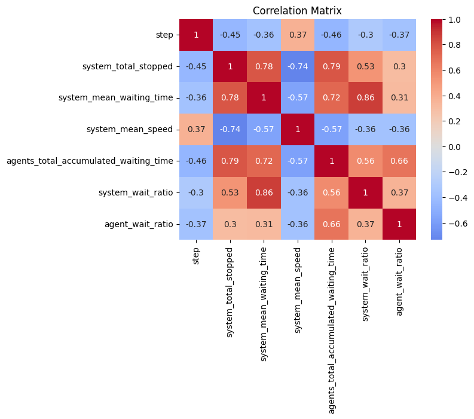
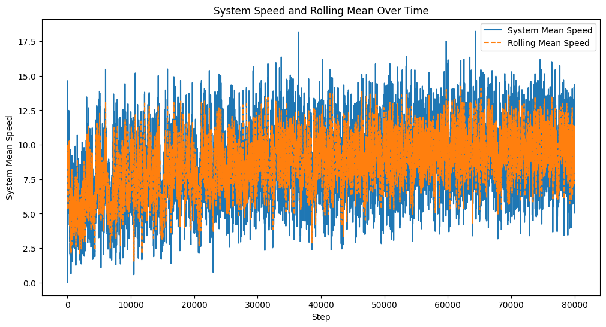

# Multi-Agent Traffic Optimization

  
  

**Objective**: Mitigate congestion and reduce wait times at a particularly busy and dangerous Miami intersection.

**Approach**:
   - **Data & Simulation**: Leveraged **OpenStreetMap** to model the intersection and simulate peak traffic conditions using **SUMO**.
   - **Reinforcement Learning Setup**: Framed traffic lights as RL agents within a **SUMO-RL** and **Ray RLlib** environment. The agents observed traffic density, queue lengths, and signal phases, adjusting signals at discrete time intervals.
- **Multi-Agent Coordination**: Employed a multi-agent RL framework, allowing each traffic light to make decisions that collectively optimized overall traffic flow.
- **Policy & Algorithm**: Implemented **PPO** for stable training, capable of handling multiple agents interacting simultaneously.

**Key Results**:
- Achieved up to a **90% reduction in average vehicle wait times** after 100,000 training steps, lowering delays to roughly one minute or under.
- Demonstrated the scalability and adaptability of RL policies to real-world intersections, improving traffic efficiency and safety.

---

# Traffic Light Data Analysis
**Author**: [Abhilash Rana](https://www.linkedin.com/in/abhilash-rana-fl/)

### **Summary of key trends**

**Negative Correlations with Steps**:
   - **system_total_stopped** (-0.45) and **agents_total_accumulated_waiting_time** (-0.46) decrease as steps progress, indicating reduced congestion or delays over time.
   - **system_mean_speed** has a positive correlation (0.37), suggesting that as steps increase, speed improves.

**Congestion-Related Metrics**:
   - **system_total_stopped**, **system_mean_waiting_time**, and **agents_total_accumulated_waiting_time** are **strongly** positively correlated (0.78–0.79), showing that more stopping leads to longer waiting times.

**Speed and Congestion**:
   - **system_mean_speed** negatively correlates with congestion metrics like **system_total_stopped** (-0.74) and **system_mean_waiting_time** (-0.57), highlighting that higher speeds reduce stopping and waiting times.

**Wait Ratios**:
   - **system_wait_ratio** and **agent_wait_ratio** are positively correlated with waiting metrics (e.g., **system_mean_waiting_time**, 0.86), indicating these ratios increase with longer waits.

---

**System Mean Speed (Blue Line)**:
   - The blue line shows raw data for the system's mean speed at each step.
   - There is considerable fluctuation in speed, with spikes and dips indicating moments of acceleration and deceleration.

**Rolling Mean Speed (Orange Dashed Line)**
   - The orange dashed line represents the 5-step rolling average of the system's mean speed.
   - It smooths out the short-term variations and provides a clearer view of the overall trend in system speed.

### Key Observations

- The rolling mean stays close to the center of the fluctuations, indicating that the speed does not exhibit significant long-term upward or downward trends.
- Periods of higher fluctuation in the blue line (raw speed) are still averaged out in the rolling mean, making it easier to identify the system's overall stability.

---

## The Tale of Traffic Insights: A Machine Learning Adventure

Once upon a time, in the bustling world of traffic management, a team of engineers embarked on a mission to revolutionize the way congestion was analyzed. They had mountains of data from sensors spread across a vast metropolis, but understanding and predicting traffic patterns remained a monumental challenge.

### The Quest for Thresholds

The team decided to tackle the problem by classifying traffic into two states: *High Congestion* and *Low Congestion*. Instead of arbitrarily defining what "high" or "low" meant, they turned to a dynamic approach: quantiles.

By analyzing the data, they discovered that the **top 25% of system_total_stopped vehicles** represented severe congestion, and the **bottom 25% of system_mean_speed** captured scenarios of frustratingly slow-moving traffic. These insights set the foundation for their classification system.

### Breathing Life into the Data

Using their thresholds, the team devised a way to label the data. If a section of the city experienced both a high number of stopped vehicles and painfully low speeds, it was branded as *High Congestion* (1). Otherwise, it was marked as *Low Congestion* (0).

To ensure the data was clean and reliable, they removed any incomplete entries, leaving behind a pristine dataset.

## Training the Classifier: ML Regression Model

With the data prepared, the team turned their attention to building a classification model. They carefully selected features—*total stopped vehicles*, *average speed*, *stop-to-wait ratio*, and *wait efficiency*—believing these would hold the key to understanding congestion.

The dataset was split into training and testing sets, and the chosen warrior for this task was a traditional Logistic Regression **ML model**, known for its simplicity and efficiency.

## The Moment of Truth

After training the model, it was time to assess its performance. The team eagerly tested the classifier on unseen data, making predictions about congestion levels in various parts of the city.

As the results rolled in, the engineers were thrilled to see the model in action. The predicted congestion levels flashed on their screens, offering a glimpse into the city’s traffic dynamics.

## Triumph and Beyond

The results were presented to city planners, showcasing how the model could help predict and manage congestion. The planners were impressed by the insights and decided to integrate the model into their traffic management systems. Armed with this tool, they could now optimize traffic signals, plan infrastructure upgrades, and improve the daily commute for millions of citizens.

And so, with a blend of data science and determination, the team transformed the chaos of urban traffic into a story of clarity and control, proving that even in the densest of jungles, patterns can emerge and guide the way forward.

## Unveiling Traffic Trends: Predicting Speeds with ARIMA

In their continued quest to make city traffic flow like a well-oiled machine, the team ventured into the realm of time series forecasting. The target? To predict the **system_mean_speed** of vehicles, a key metric reflecting traffic flow efficiency. Armed with ARIMA, a powerful statistical model, they set out to peer into the future.

### The Foundation: What is ARIMA?

ARIMA (AutoRegressive Integrated Moving Average) is a widely used model for analyzing and forecasting time series data. Its strength lies in capturing trends, patterns, and noise in a dataset by tuning three key parameters:

- **p**: The number of lag observations (AutoRegressive component).
- **d**: The number of differences to make the data stationary (Integrated component).
- **q**: The size of the moving average window (Moving Average component).

The team decided to use **ARIMA(1, 1, 1)** as their starting configuration, which incorporated one lag for past values, one differencing step to stabilize trends, and one error term to account for residual noise.

## Modeling the Future

Using historical system_mean_speed data, they trained the ARIMA model to understand the city's traffic behavior. After careful calibration, the model was ready to forecast the next five intervals.

### Forecast Results

The results suggested that traffic speeds would gradually increase, possibly signaling a reduction in congestion during these intervals.

## Implications and Applications

The ARIMA forecast was more than just numbers; it was a window into how traffic might evolve in the near term. Armed with these predictions, the city planners could:

- **Preemptively address bottlenecks**: Use the forecast to allocate resources to areas where congestion might ease or worsen.
- **Optimize traffic signals**: Adjust signal timings to maintain steady traffic flow.
- **Enhance public communication**: Inform commuters of expected conditions, enabling better travel planning.

## Lessons Learned

This experiment demonstrated the power of time series modeling in urban planning. However, the team also knew the ARIMA model had its limitations. The next step was to incorporate external factors—like weather, special events, or road conditions—into the forecasting process, refining their predictions further.

In the meantime, the ARIMA-generated insights proved invaluable, shining a light on what lay ahead in the bustling city streets and paving the way for smarter, data-driven traffic management.

---